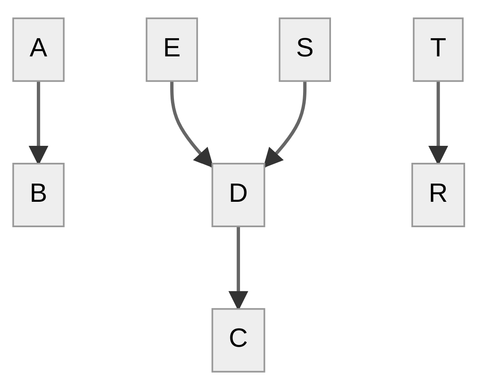

# Md-Markdown-Test

`render-md-mermaid` will pick up any Mermaid graph in Markdown files that is defined as:


<details>
  <summary>diagram source</summary>
  This details block is collapsed by default when viewed in GitHub.
  This hides the mermaid graph definition, while the rendered image
  linked above is shown.
  The details tag has to follow the image tag. (newlines allowed)

  ```mermaid
graph TD;
    F-->B;
    G-->C;
    P-->D;
    S-->D;
    T-->R;
```    
</details>



<details>
  <summary>diagram source</summary>
  This details block is collapsed by default when viewed in GitHub.
  This hides the mermaid graph definition, while the rendered image
  linked above is shown.
  The details tag has to follow the image tag. (newlines allowed)

  ```mermaid
graph TD;
    A-->B;
    D-->C;
    E-->D;
    S-->D;
    T-->R;
```
</details>

