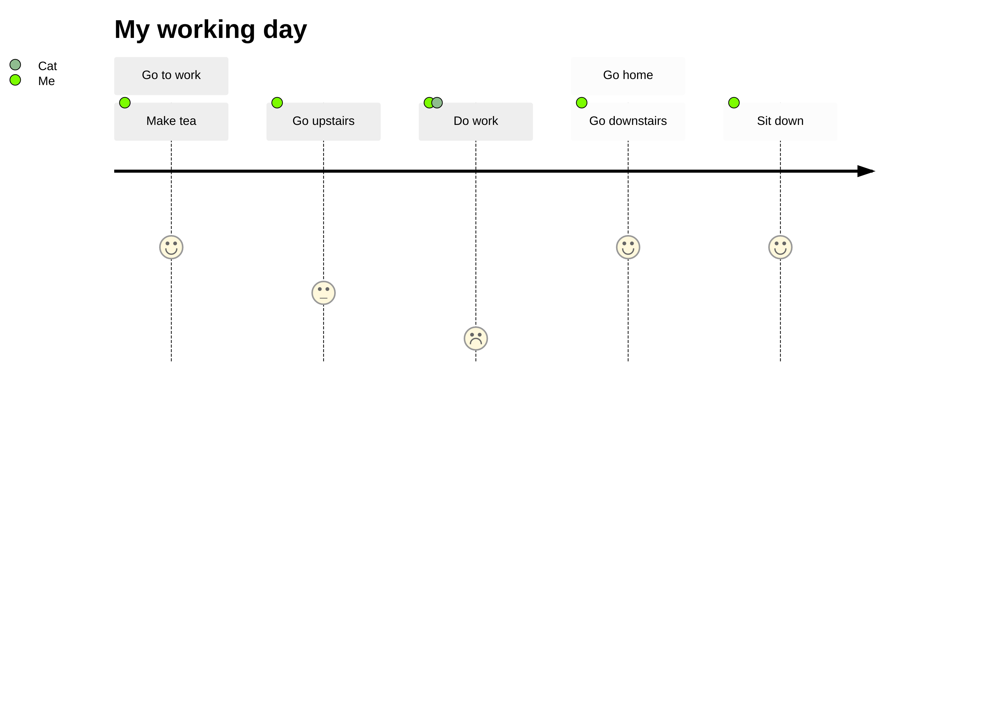

# Md-Markdown-Test

`render-md-mermaid` will pick up any Mermaid graph in Markdown files that is defined as:


<details>
  <summary>diagram source</summary>
  This details block is collapsed by default when viewed in GitHub.
  This hides the mermaid graph definition, while the rendered image
  linked above is shown.
  The details tag has to follow the image tag. (newlines allowed)

  ```mermaid
journey
title My working day
section Go to work
Make tea: 5: Me
Go upstairs: 3: Me
Do work: 1: Me, Cat
section Go home
Go downstairs: 5: Me
Sit down: 5: Me
```    

</details>
