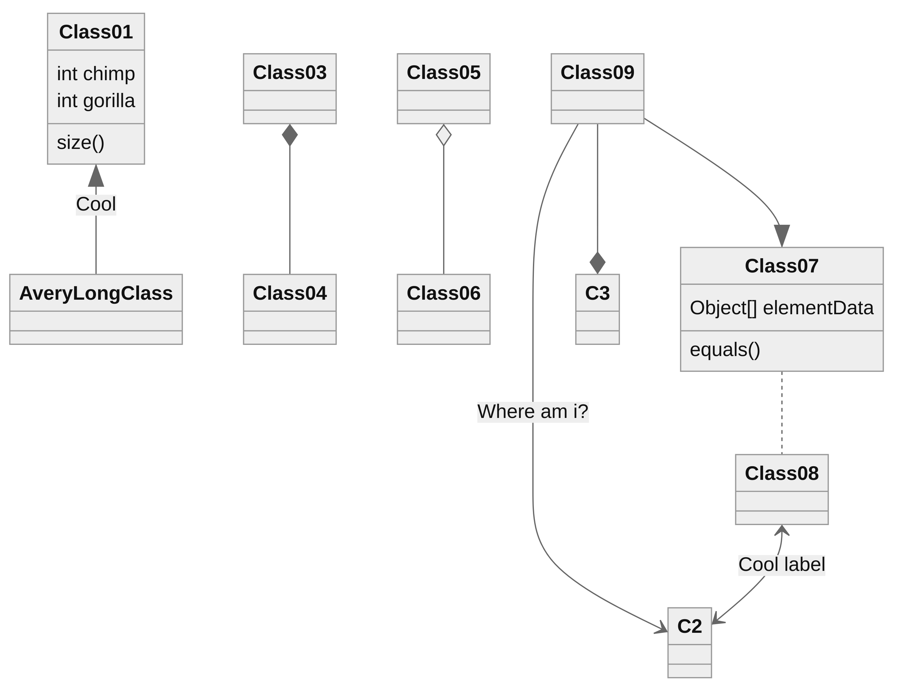

# Md-Markdown-Test

`render-md-mermaid` will pick up any Mermaid graph in Markdown files that is defined as:


<details>
  <summary>diagram source</summary>
  This details block is collapsed by default when viewed in GitHub.
  This hides the mermaid graph definition, while the rendered image
  linked above is shown.
  The details tag has to follow the image tag. (newlines allowed)

  ```mermaid
classDiagram
Class01 <|-- AveryLongClass : Cool
Class03 *-- Class04
Class05 o-- Class06
Class07 .. Class08
Class09 --> C2 : Where am i?
Class09 --* C3
Class09 --|> Class07
Class07 : equals()
Class07 : Object[] elementData
Class01 : size()
Class01 : int chimp
Class01 : int gorilla
Class08 <--> C2: Cool label
```    

</details>
