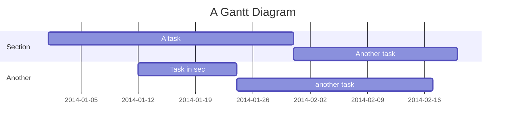

  
diagram source

  This details block is collapsed by default when viewed in GitHub. This hides the mermaid graph definition, while the rendered image
  linked above is shown. The details tag has to follow the image tag. (newlines allowed)

  

gantt
    title A Gantt Diagram
    dateFormat  YYYY-MM-DD
    section Section
    A task           :a1, 2014-01-01, 30d
    Another task     :after a1  , 20d
    section Another
    Task in sec      :2014-01-12  , 12d
    another task      : 24d
