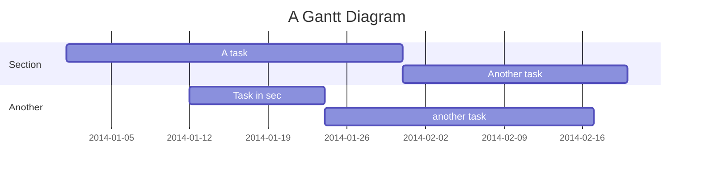
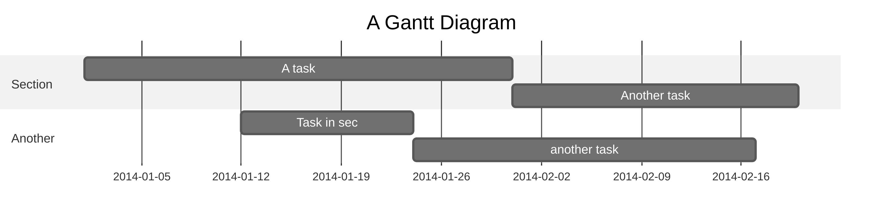

# Md-Markdown-Test

`render-md-mermaid` will pick up any Mermaid graph in Markdown files that is defined as:

~~~markdown

  
diagram source

  This details block is collapsed by default when viewed in GitHub. This hides the mermaid graph definition, while the rendered image
  linked above is shown. The details tag has to follow the image tag. (newlines allowed)

  

~~~

The script will pick up the graph definition from the mermaid code block and render it to the image file and path specified in the
image tag using [mermaid-cli](https://github.com/mermaid-js/mermaid-cli). The rendered image can be in svg or png format, whatever is specified will be generated. The result is displayed like this:

  
diagram source

  This details block is collapsed by default when viewed in GitHub.
  This hides the mermaid graph definition, while the rendered image
  linked above is shown.
  The details tag has to follow the image tag. (newlines allowed)

