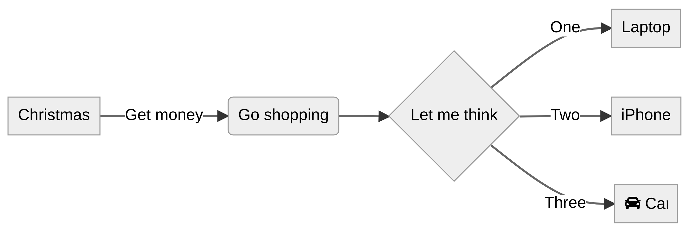
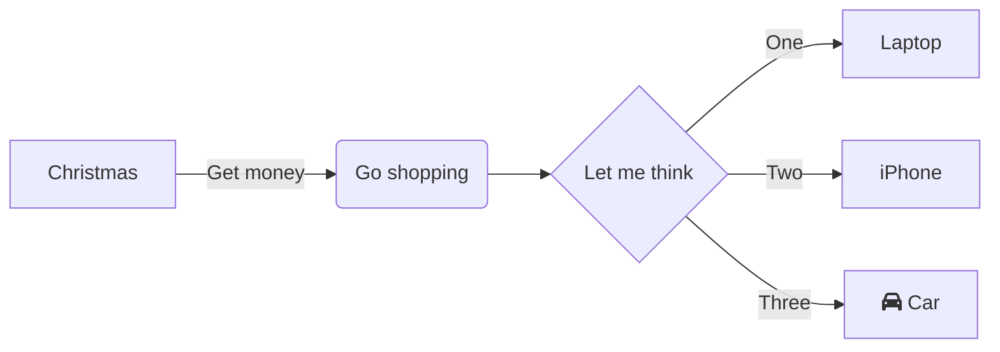

# Md-Markdown-Test

```mermaid
graph LR 
    A[Christmas] -->|Get money| B(Go shopping) 
    B --> C{Let me think} 
    C -->|One| D[Laptop] 
    C -->|Two| E[iPhone] 
    C -->|Three| F[fa:fa-car Car]
```   
  

